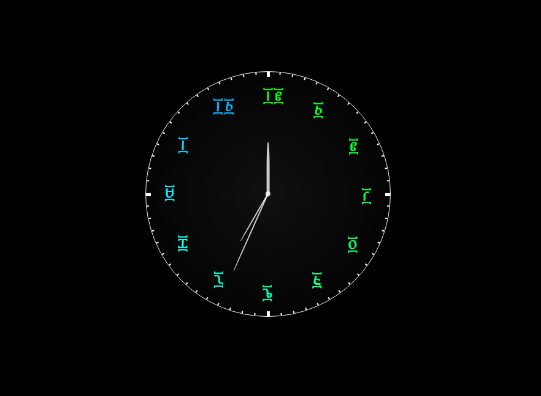

# Analog Clock with Ge'ez Numbers
---

### [Live Preview](https://amh-clock.netlify.app/)

This project is an analogue clock, created using HTML, CSS, and JavaScript, featuring **Ge'ez** numbers for the time display. Ge'ez numbers are traditionally used in Ethiopia and Eritrea.

## Features

- Displays time using Ge'ez numbers on an analog clock face.
- Provides an accurate representation of the current time.
- Simple and intuitive user interface.

### How to Use?

To view the analog clock, simply open the `index.html` file in a web browser.

### What is the color refers?

In Ethiopian time format, at the Morning time starts with 12:00. so the font color shows the amount of your freshness :blush:

## Technologies Used

- HTML
- CSS
- **JavaScript**

## Contributing

Contributions are welcome! Please feel free to submit any bug fixes or enhancements as pull requests.

## Contact

For any questions or inquiries, feel free to contact the project maintainer at [telegram](https://t.me/henaorth).
